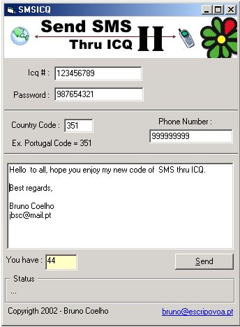

<div align="center">

## SMSICQ2


</div>

### Description

Send SMS messages thru the ICQ server without using a browser to do the job, or having to go to the ICQ web page.

The guys in ICQ keep changing the way you send the messages...but hey.... we keep changing it too!

VB Programmers ROCK ! :-)
 
### More Info
 


<span>             |<span>
---                |---
**Submitted On**   |2002-01-25 12:01:10
**By**             |[Bruno Coelho](https://github.com/Planet-Source-Code/PSCIndex/blob/master/ByAuthor/bruno-coelho.md)
**Level**          |Advanced
**User Rating**    |4.6 (32 globes from 7 users)
**Compatibility**  |VB 5\.0, VB 6\.0
**Category**       |[Complete Applications](https://github.com/Planet-Source-Code/PSCIndex/blob/master/ByCategory/complete-applications__1-27.md)
**World**          |[Visual Basic](https://github.com/Planet-Source-Code/PSCIndex/blob/master/ByWorld/visual-basic.md)
**Archive File**   |[SMSICQ2509181252002\.zip](https://github.com/Planet-Source-Code/bruno-coelho-smsicq2__1-31170/archive/master.zip)

### API Declarations

```
'Just check it out you will LOVE IT !
```


